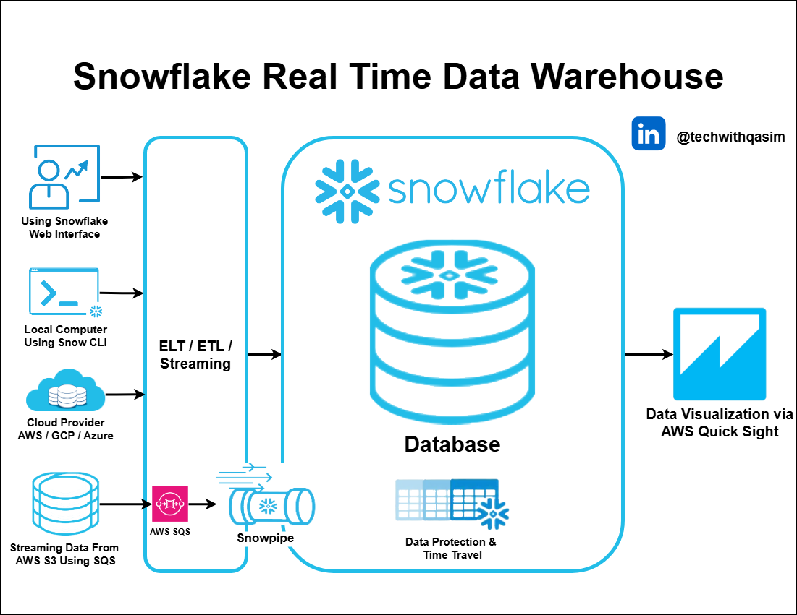

## Project 3: Snowflake Real Time Data Warehouse Project

- Introduction to Snowflake
- Understanding Snowflake Architecture
- Understanding Security in Snowflake
- Preparation of files
- Configuration setup for Snowflake
- Loading data through the web interface
- Loading data through SnowSQL
- Loading data using Cloud Provider
- Streaming data using Snowpipe
- Time Travel in Snowflake
- Visualization using QuickSight